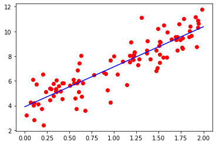

# Data prep


```python
import numpy as np
import matplotlib.pyplot as plt
```


```python
X = 2 * np.random.rand(100, 1)
y = 4 + 3 * X + np.random.randn(100, 1)
```


```python
X_b = np.c_[np.ones((100, 1)), X]
```


```python
theta_best = np.linalg.inv(X_b.T.dot(X_b)).dot(X_b.T).dot(y)
```


```python
theta_best

```


    array([[3.9094383 ],
           [3.23330987]])


```python
X_new = np.array([[0], [2]])
X_new_b = np.c_[np.ones((2, 1)), X_new]
y_predict =  X_new_b.dot(theta_best)
```


```python
plt.plot(X , y , 'ro')
plt.plot(X_new, y_predict, "b-")

plt.show()
```





```python
from sklearn.linear_model import LinearRegression
lin_reg = LinearRegression()
lin_reg.fit(X, y)
```


    LinearRegression(copy_X=True, fit_intercept=True, n_jobs=None, normalize=False)


```python
lin_reg.intercept_, lin_reg.coef_
```


    (array([3.9094383]), array([[3.23330987]]))


```python
lin_reg.predict(X_new)
```


    array([[ 3.9094383 ],
           [10.37605804]])


```python
theta_best_svd, residuals, rank, s = np.linalg.lstsq(X_b, y, rcond=1e-6)
theta_best_svd
```


    array([[3.9094383 ],
           [3.23330987]])


```python
np.linalg.pinv(X_b).dot(y)
```


    array([[3.9094383 ],
           [3.23330987]])


# Batch Gradient Descent


```python
eta = 0.1 # learning rate
n_iterations = 1000
m = 100
```


```python
theta = np.random.randn(2,1)
# random initialization
```


```python
theta
```


    array([[1.50724457],
           [0.73376977]])


# Stochastic Gradient Descent


```python
n_epochs = 50
t0, t1 = 5, 50
```


```python
def learning_schedule(t):
    return t0 / (t + t1)
```


```python
theta = np.random.randn(2,1)
```


```python
for epoch in range(n_epochs):
    for i in range(m):
        random_index = np.random.randint(m)
        xi = X_b[random_index:random_index+1]
        yi = y[random_index:random_index+1]
        gradients = 2 * xi.T.dot(xi.dot(theta) - yi)
        eta = learning_schedule(epoch * m + i)
        theta = theta - eta * gradients
```


```python
theta
```


    array([[3.9299559],
           [3.2497815]])


```python
from sklearn.linear_model import SGDRegressor
sgd_reg = SGDRegressor(max_iter=1000, tol=1e-3, penalty=None, eta0=0.1)
sgd_reg.fit(X, y.ravel())
```


    SGDRegressor(alpha=0.0001, average=False, early_stopping=False, epsilon=0.1,
                 eta0=0.1, fit_intercept=True, l1_ratio=0.15,
                 learning_rate='invscaling', loss='squared_loss', max_iter=1000,
                 n_iter_no_change=5, penalty=None, power_t=0.25, random_state=None,
                 shuffle=True, tol=0.001, validation_fraction=0.1, verbose=0,
                 warm_start=False)


```python
sgd_reg.intercept_, sgd_reg.coef_
```


    (array([3.86917814]), array([3.20813404]))


