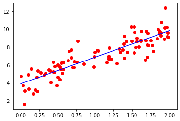

```python
import numpy as np
import matplotlib.pyplot as plt
```


```python
X = 2 * np.random.rand(100, 1)
y = 4 + 3 * X + np.random.randn(100, 1)
```


```python
X_b = np.c_[np.ones((100, 1)), X]
```


```python
X_b

```


 


```python
theta_best = np.linalg.inv(X_b.T.dot(X_b)).dot(X_b.T).dot(y)
```


```python
theta_best

```


    array([[3.87608605],
           [2.97262453]])


```python
X_new = np.array([[0], [2]])
X_new_b = np.c_[np.ones((2, 1)), X_new]
y_predict =  X_new_b.dot(theta_best)
```


```python
plt.plot(X , y , 'ro')
plt.plot(X_new, y_predict, "b-")

plt.show()
```





```python
from sklearn.linear_model import LinearRegression
lin_reg = LinearRegression()
lin_reg.fit(X, y)
```


```python
lin_reg.intercept_, lin_reg.coef_
```


    (array([3.87608605]), array([[2.97262453]]))


```python
lin_reg.predict(X_new)
```


    array([[3.87608605],
           [9.82133511]])


```python
theta_best_svd, residuals, rank, s = np.linalg.lstsq(X_b, y, rcond=1e-6)
theta_best_svd
```


    array([[3.87608605],
           [2.97262453]])


```python
np.linalg.pinv(X_b).dot(y)
```


    array([[3.87608605],
           [2.97262453]])


